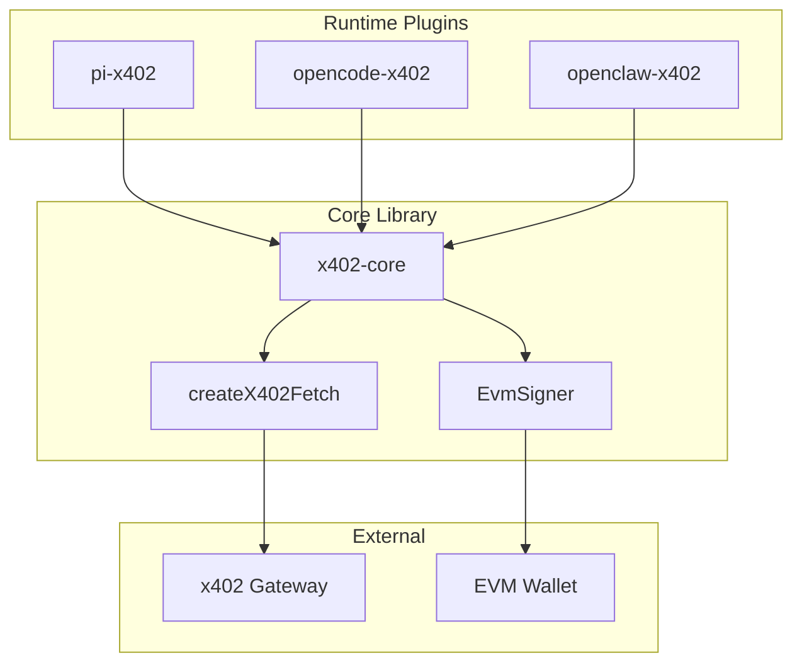

# x402-plugins

面向 **Pi**、**OpenCode**、**OpenClaw**（及任意支持标准 x402 HTTP 头的运行时）的 **钱包原生 x402 插件 monorepo**。

协议与头实现基于官方生态（[`@x402/core`](https://www.npmjs.com/package/@x402/core)、[`@x402/fetch`](https://www.npmjs.com/package/@x402/fetch)），本仓库只做 **运行时薄适配**，不重复实现 `PAYMENT-*` 编解码。

## 架构概览



## 仓库结构

```text
packages/
  x402-core/       # 共享：fetch 包装、配置、钱包 signer 接口（无 Pi/OpenCode 依赖）
  pi-x402/         # Pi extensions + registerProvider 骨架
  opencode-x402/   # OpenCode 插件入口骨架
  openclaw-x402/   # OpenClaw plugin-sdk 入口骨架（可选 facilitator）
examples/          # 本地联调示例路径
docs/              # 补充设计笔记
scripts/           # 构建与测试工具脚本
SPEC.md            # 需求与里程碑 SSOT
```

## 快速开始

### 前置条件

- Node.js >= 20
- npm >= 9

### 安装与构建

```bash
# 1. 克隆仓库
git clone https://github.com/zcf-cyber/x402-provider-plugins.git
cd x402-provider-plugins

# 2. 安装依赖
npm install

# 3. 构建所有包
npm run build

# 4. 配置环境变量
cp .env.example .env
# 编辑 .env 填写 gateway / 链配置
```

### Pi 集成

```bash
# 安装 Pi 扩展
npm run install:pi-extensions

# 启动 Pi 并加载 x402 扩展
pi -e ./packages/pi-x402/extensions/x402-provider.ts \
   -e ./packages/pi-x402/extensions/x402-wallet.ts
```

### OpenCode 集成

1. 将 `examples/opencode/opencode.json` 复制到你的 OpenCode 项目根目录
2. 配置 `X402_GATEWAY_URL` 和 `X402_PRIVATE_KEY` 环境变量
3. 启动 OpenCode，插件将自动拦截 provider 请求

详细配置见 `examples/opencode/README.md`。

### OpenClaw 集成

```bash
# 在 OpenClaw 项目中安装依赖
npm install @x402-plugins/openclaw-x402

# 按照 OpenClaw 插件文档配置
# 详见 packages/openclaw-x402/README.md
```

### 本地测试（Mock Gateway）

```bash
# 启动 mock x402 gateway
node scripts/mock-gateway.mjs --port 8080

# 运行 smoke test
npm run smoke
```

## 环境变量

| 变量 | 必需 | 默认值 | 说明 |
|------|------|--------|------|
| `X402_GATEWAY_URL` | ✅ | - | x402 gateway 地址 |
| `X402_PRIVATE_KEY` | ✅ | - | EVM 钱包私钥（仅开发环境） |
| `X402_CHAIN_ID` | ❌ | `eip155:8453` | EVM 链 ID |
| `X402_PROTOCOL_VERSION` | ❌ | `2` | 协议版本（1 或 2） |
| `X402_DISCOVERY_URL` | ❌ | - | Discovery 服务索引 URL |
| `X402_ALLOWLIST` | ❌ | - | 服务白名单（逗号分隔） |

## 调试与故障排除

### 常见问题

#### 1. 构建失败

```bash
# 清理并重新构建
npm run clean
npm install
npm run build
```

#### 2. 类型检查错误

```bash
# 运行类型检查
npm run typecheck

# 检查特定包
npm run typecheck -w @x402-plugins/core
```

#### 3. 测试失败

```bash
# 运行所有测试
npx vitest run

# 运行特定包测试
npx vitest run packages/x402-core/src/__tests__/

# 运行 smoke test
npm run smoke
```

#### 4. Pi 扩展加载失败

```bash
# 确保扩展已安装
npm run install:pi-extensions

# 检查扩展文件
ls -la ~/.pi/agent/extensions/

# 手动链接扩展
ln -sf $(pwd)/packages/pi-x402/extensions/*.ts ~/.pi/agent/extensions/
```

#### 5. Gateway 连接问题

```bash
# 测试 gateway 连接
curl -v http://127.0.0.1:8080/v1/chat/completions

# 预期响应：402 + PAYMENT-REQUIRED 头
```

#### 6. 签名验证失败

- 确保 `X402_PRIVATE_KEY` 格式正确（0x 开头的 hex 字符串）
- 检查私钥对应的地址是否有足够余额
- 验证链 ID 与目标网络匹配

### 获取帮助

- 查看 [SPEC.md](./SPEC.md) 了解详细设计
- 查看 [docs/protocol-headers.md](./docs/protocol-headers.md) 了解协议头格式
- 提交 [GitHub Issue](https://github.com/zcf-cyber/x402-provider-plugins/issues)

## 贡献指南

1. Fork 本仓库
2. 创建功能分支：`git checkout -b feature/your-feature`
3. 提交更改：`git commit -m "feat: add your feature"`
4. 推送分支：`git push origin feature/your-feature`
5. 创建 Pull Request

### 开发规范

- 使用 TypeScript，遵循 ESM 模块系统
- 所有公共函数需要单元测试
- 错误信息以 `x402:` 前缀开头
- 环境变量需要提供默认值

## 发布

查看 [GitHub Releases](https://github.com/zcf-cyber/x402-provider-plugins/releases) 获取最新版本。

### 发布流程

```bash
# 运行发布脚本
./scripts/release.sh

# 或手动发布
npm run build
npm run typecheck
npm run smoke
```

## 许可

MIT
